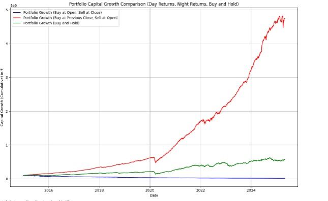

# 🌓 Nifty 50 Return Strategy Analysis – Day vs Night vs Buy & Hold

## 📌 Overview

This project investigates **where the real returns lie in the stock market** — during the day, overnight, or simply by holding. Using NIFTY 50 historical data, I tested three distinct strategies over the last 15 years:

- 🕘 **Day Strategy** – Buy at market open, sell at close (intraday only)
- 🌙 **Night Strategy** – Buy at previous close, sell at next day’s open (overnight returns)
- 📈 **Buy & Hold** – Traditional long-term investment approach

---

## 💡 Why Night Strategy Works

Historical data shows that **significant returns happen outside of trading hours**. This can be due to:
- Global market movements
- Institutional positioning via futures
- Overnight news or economic data releases

By avoiding intraday noise and capturing **gap-ups**, the night strategy often outperforms.

---

## ⚙️ What I Did

- Allocated **equal capital** to all NIFTY 50 stocks (non-weighted).
- Calculated:
  - ✅ Overnight returns (Close to next Open)
  - ✅ Intraday returns (Open to Close)
  - ✅ Buy & Hold returns
- Computed performance metrics for each strategy:
  - 📊 Sharpe Ratio
  - 📉 Max Drawdown
  - 📈 Average Win % and Average Loss %
  - 📅 Annualized & Total Returns
- Visualized portfolio capital growth over time.

---

## 📊 Strategy Results

| Strategy         | Total Returns | Annualized Returns |
|------------------|---------------|---------------------|
| ☀️ Day Strategy   | **-86.17%**   | **-17.42%**         |
| 🌙 Night Strategy | **4639.46%**  | **45.25%**          |
| 📈 Buy & Hold     | **467.80%**   | **18.29%**          |

> 🔍 *Sharpe ratios were above 1 for most stocks in Night Strategy, with some exceeding 3. Win rate was above 60% for nearly every stock.*

---

## 📁 Files

- `Day_and_Night_Nifty50.ipynb` – Main notebook with code and logic
- `Portfolio_Growth.png` – Capital Growth comparison image

---

## ✅ Key Takeaway

> 💰 **Most of the stock market gains occur when the market is closed.**  
>  
> This analysis shows that **overnight positions consistently outperformed** intraday trading and long-term holding, both in terms of raw returns and risk-adjusted performance.

---

